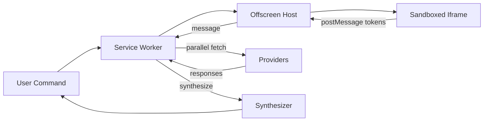

Below is a high-level product context document for the HTOS system, designed to align with the implementation principles derived from the HARPA codebase analysis. This document focuses on the architectural approach to handling Content Security Policy (CSP), Declarative Net Requests, bus messaging, iframe creation, authentication, and race conditions, while keeping details flexible to accommodate features that are not yet finalized.

---

## HTOS Product Context Document

### Overview

HTOS is a Chrome extension framework engineered to deliver robust, secure, and efficient functionality in the face of modern web challenges. Drawing inspiration from the HARPA codebase, HTOS addresses two core architectural hurdles: **The Authority & Context Problem** and **The Race Condition Problem**. These challenges arise when operating within the constraints of Chrome’s extension architecture and the defensive mechanisms of sophisticated websites. This document outlines the high-level strategies and principles guiding HTOS’s approach to critical components, ensuring alignment with architectural best practices while maintaining adaptability for future development.

### Core Architectural Challenges

1. **The Authority & Context Problem**  
   The Service Worker (background script) serves as the extension’s control center but lacks access to DOM APIs and iframe hosting capabilities. Content scripts, embedded in target pages, operate in a restrictive environment with limited privileges. HTOS must enable privileged operations—such as authenticated network requests or DOM manipulation—from these constrained contexts.

2. **The Race Condition Problem**  
   Websites deploy anti-automation defenses that activate as pages load, requiring HTOS to modify the environment preemptively. Winning this race ensures the extension can operate undetected and effectively against such protections.

### Component Guidelines

HTOS’s architecture is built around a mandate for handling key components: CSP, Declarative Net Requests, bus messaging, iframe creation, authentication, and race conditions. Below are the high-level principles for each, designed to ensure consistency, security, and performance.

#### 1. Content Security Policy (CSP) Handling

**Objective:** Enable functionality despite CSP restrictions on target pages.  
**Approach:**
- **Detection and User Control:** Implement systems to identify CSP barriers and offer user-configurable options (e.g., temporary or persistent bypass) to mitigate them on a per-tab basis.
- **Offscreen Environment:** Leverage an Offscreen Document as a secure, CSP-free context for operations that target pages might block.
- **Utility Proxying:** Route restricted API calls (e.g., storage or URL operations) through a communication layer to the Offscreen Document when CSP interferes.

**Rationale:**  
CSP can disrupt extension operations by blocking scripts or requests. This approach ensures HTOS remains functional by adapting to restrictions dynamically while maintaining a fallback environment for critical tasks.

#### 2. Declarative Net Requests

**Objective:** Efficiently manipulate network traffic for security and compatibility.  
**Approach:**
- **Header Management:** Use Declarative Net Requests to adjust request headers, enabling authentication and bypassing website defenses for specific, relevant domains.
- **Early Application:** Register network rules at the extension’s initialization to ensure modifications occur before requests are processed.
- **Fallback Support:** Include rules to address loading constraints, such as removing restrictive headers for embedded content.

**Rationale:**  
Declarative Net Requests provide a low-overhead, preemptive method to shape network interactions, critical for integrating with external services and evading detection by anti-automation systems.

#### 3. Bus Messaging

**Objective:** Facilitate seamless communication across isolated contexts.  
**Approach:**
- **Centralized System:** Establish a message bus as the primary channel for interaction between the background script, Offscreen Document, content scripts, and other components.
- **Data Handling:** Support serialization and deserialization for complex data types to ensure reliable transfer across contexts.
- **Event Structure:** Define standardized event types and handlers to route tasks efficiently to the appropriate context.

**Rationale:**  
A robust bus system resolves the Authority & Context Problem by bridging isolated environments, enabling coordinated operations and maintaining data integrity across the extension.

#### 4. Iframe Creation

**Objective:** Provide a controlled environment for DOM-dependent tasks.  
**Approach:**
- **Offscreen Hosting:** Create iframes within the Offscreen Document for operations requiring DOM access, free from target page constraints.
- **Reliability Measures:** Implement checks and retries to ensure iframe stability and responsiveness.
- **Integration:** Connect iframes to the bus messaging system for secure data and command exchange.

**Rationale:**  
Iframes in a CSP-free context allow HTOS to perform tasks like processing or rendering that are otherwise restricted, with stability and communication ensuring operational reliability.

#### 5. Authentication

**Objective:** Securely manage and apply authentication for external interactions.  
**Approach:**
- **Centralized Storage:** Handle authentication credentials (e.g., tokens) using secure, centralized mechanisms accessible across contexts.
- **Network Injection:** Utilize Declarative Net Requests to embed authentication data into relevant requests seamlessly.
- **Safeguards:** Incorporate rate limiting and error handling to maintain stability and avoid service disruptions.

**Rationale:**  
Secure, efficient authentication ensures HTOS can interact with external services reliably, minimizing exposure risks and maintaining compliance with provider limits.

#### 6. Race Conditions

**Objective:** Outpace website defenses to maintain functionality.  
**Approach:**
- **Preemptive Action:** Apply network modifications (e.g., header adjustments) as early as possible in the extension lifecycle.
- **Timing Coordination:** Use a timing system and bus messaging to synchronize operations, ensuring modifications precede defensive scripts.
- **Task Delegation:** Offload potentially blocking tasks to the Offscreen Document to keep the background script responsive for rapid network adjustments.

**Rationale:**  
Winning the race against anti-automation measures requires proactive and precisely timed interventions, supported by a responsive architecture that avoids delays.

### System Interactions

HTOS’s components work in concert to address its architectural challenges:
- The **background script** orchestrates operations, leveraging Declarative Net Requests and the bus for network and context management.
- The **Offscreen Document** serves as a privileged sandbox, hosting iframes and handling DOM tasks, accessible via the bus.
- **Content scripts** operate within target pages, relying on the bus to relay commands and data to more capable contexts.
- **Network rules** and **timing mechanisms** ensure HTOS acts swiftly and discreetly against defensive measures.

### Conclusion

This product context document establishes a flexible, high-level framework for HTOS, aligning with HARPA’s proven strategies for CSP handling, Declarative Net Requests, bus messaging, iframe creation, authentication, and race condition management. By adhering to these principles, HTOS ensures a secure, efficient, and adaptable architecture capable of meeting current needs and evolving with future requirements. This mandate serves as a guiding reference for development, fostering consistency and clarity across the system.

--- 

This document avoids hardcoding specific features (e.g., command interfaces) as requested, focusing instead on architectural principles and strategies to provide a clear, adaptable foundation for HTOS.

### **Hybrid Thinking OS — Product Context**

#### 1. Context
Hybrid Thinking OS (HTOS) embeds AI orchestration directly into the browser, addressing the complexity of managing multiple large language models (LLMs). By unifying parallel model access under a single control plane, HTOS eliminates the need for users to juggle various LLM interfaces and API keys. This reduces cognitive overhead and streamlines workflows for individuals such as researchers, developers, and content creators who depend on diverse AI providers for their tasks.

#### 2. System Overview
HTOS operates as a modular, layered runtime within the browser, leveraging Chrome extension capabilities for secure and efficient processing:

1. **Command Interface**
   - Receives user requests through CLI, keyboard shortcuts, or UI buttons.
   - Normalizes inputs into a standardized command schema for downstream processing.

2. **Orchestration Engine**
   - Implemented as a Service Worker acting as a **Command Router**.
   - Translates commands into tasks such as authentication, prompt dispatch, and synthesis.
   - will figure out about Maintains state whether method 1 or 2

3. **Execution Mesh**
   - **Offscreen Host (`0f.js`)**: Spawns and manages offscreen documents for isolated execution.
   - **Iframe-Engine (`0fh.js`)**: Loads provider adapters in sandboxed iframes to execute login flows and extract session artifacts.

4. **Provider Adapters**
   - Each adapter includes:
     - **Config (`*.json`)**: Specifies endpoint URLs, form selectors, and rate limits.
     - **Logic (`*Adapter.ts`)**: Executes DOM scripts for login, cookie extraction, and request formatting.
   - Adapters use `postMessage` to communicate credentials back to the Orchestration Engine.

5. **Fan-Out/Fan-In Dispatcher**
   - Issues parallel HTTP requests (via `fetch`) to provider backends using extracted session tokens.
   - Aggregates responses and applies merging logic through a **Synthesis Module**.

6. **Result Delivery**
   - Formats the final output (e.g., markdown, JSON) and returns it to the Command Interface for display or further processing.

#### 3. Data & State Flow

#### 4. Core Capabilities
- **Keyless Sessions**: Extracts authentication cookies via secure DOM scripts, removing the need for API key management.
- **Modular Adapters**: Enables onboarding of new providers by adding JSON configs and TypeScript adapters, without altering the core system.
- **Parallel Synthesis**: Supports configurable concurrency per provider to balance throughput and resource usage.
- **Resilience Patterns**: Incorporates circuit breakers, retries with exponential backoff, and timeout guards for fault tolerance.
- **Observability**: Captures request/response logs, error traces, and performance metrics in twe figure out method 1 or 2

#### 5. Technical Constraints & Considerations
- Operates within the browser extension security model, adhering to Content Security Policy (CSP) and iframe sandboxing.
- Configures rate limits and usage caps per provider adapter to comply with external constraints.
- Assumes message-driven decoupling to support flexibility in future UI implementations.

### **Hybrid Thinking OS — Architectural Blueprint**

#### 1. Architecture Overview
HTOS is a layered system built within the browser, utilizing Chrome extension features for background processing, secure execution, and modularity. It is designed to be extensible, resilient, and secure.

#### 2. Component Breakdown
- **Command Interface**
  - **Purpose**: Captures and normalizes user inputs.
  - **Details**: Supports multiple input methods and prepares commands for the Orchestration Engine.
- **Orchestration Engine**
  - **Purpose**: Routes tasks and manages state.
  - **Details**: A Service Worker that coordinates authentication, dispatching, and synthesis, using we will figure out mwthod 1 or 2 for state management.
- **Execution Mesh**
  - **Offscreen Host**: Manages offscreen documents for isolated execution environments.
  - **Iframe-Engine**: Runs provider adapters in sandboxed iframes for secure interactions.
- **Provider Adapters**
  - **Purpose**: Interface with specific AI providers.
  - **Details**: Consist of JSON configurations and TypeScript logic, communicating via `postMessage`.
- **Fan-Out/Fan-In Dispatcher**
  - **Purpose**: Manages parallel requests and response aggregation.
  - **Details**: Executes concurrent HTTP calls and synthesizes results.
- **Result Delivery**
  - **Purpose**: Formats and delivers outputs.
  - **Details**: Converts synthesized data into user-friendly formats.

#### 3. Interaction Flow
1. User inputs a command through the Command Interface.
2. The Orchestration Engine processes and routes the command.
3. The Execution Mesh handles provider authentication if required.
4. The Dispatcher sends parallel requests to providers.
5. Responses are synthesized and formatted by Result Delivery.
6. The final output is returned to the user.